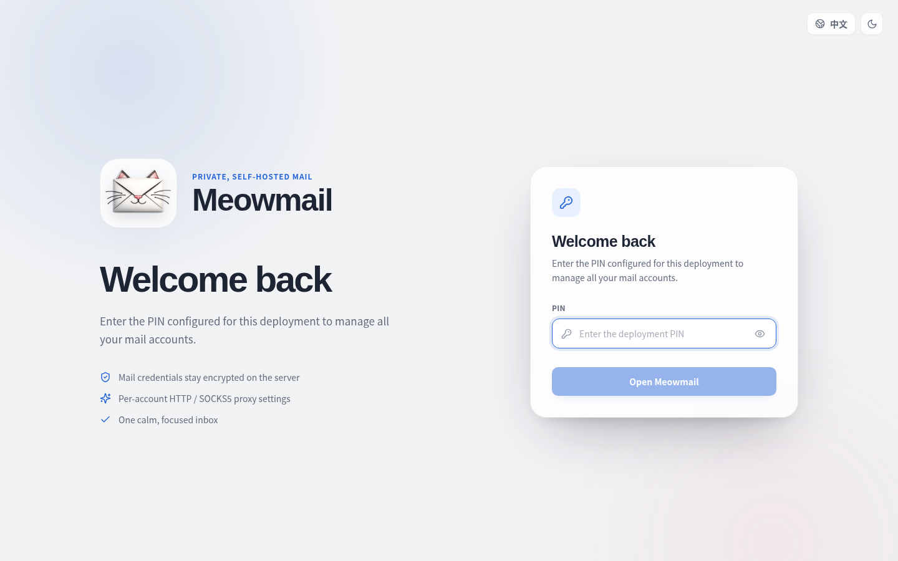
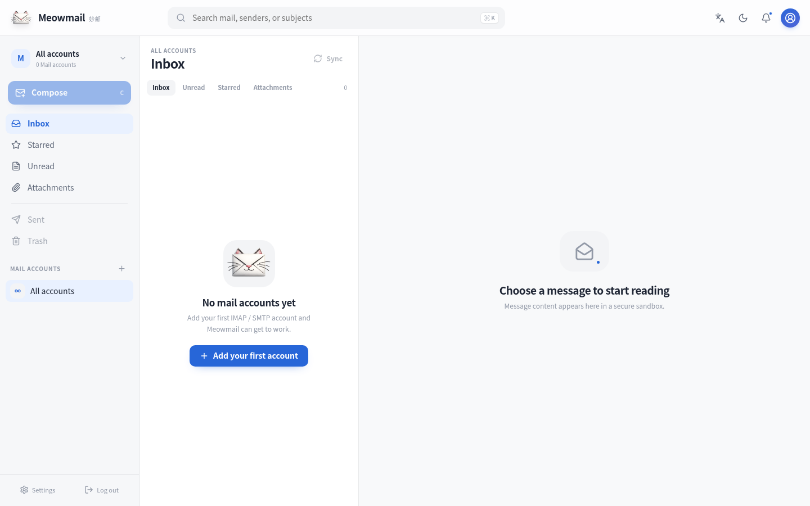
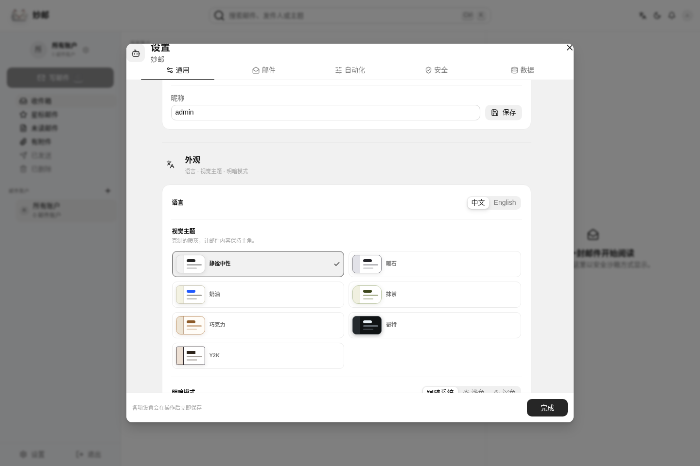
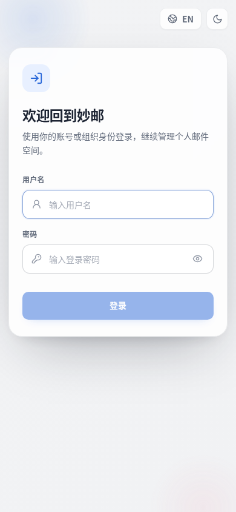
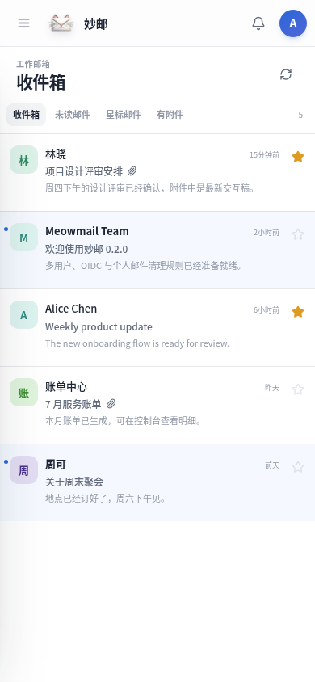
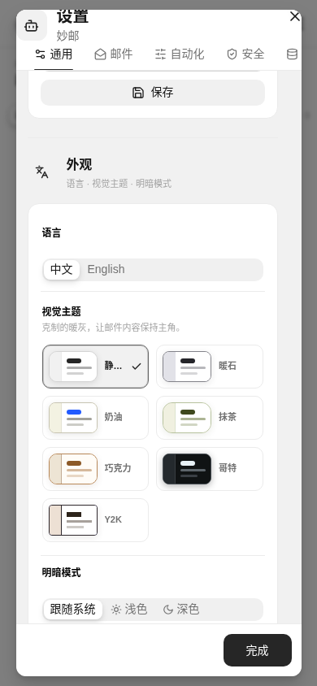

# 妙邮 / Meowmail

妙邮（Meowmail）是一个自托管、多用户、多邮件账户的 Web 邮件客户端。后端使用 Rust、Axum、SeaORM 与 SQLite，前端使用 React 19 与 Vite。生产构建会把完整 Web 资源嵌入 Rust 可执行文件，运行时无需 Node.js 或独立静态文件服务器。

`0.4.0` 使用 Astryx 重构完整前端，提供七套视觉主题，并升级邮件阅读、附件预览、设置中心与邮件账户配置体验；`0.3.0` 在多用户基础上加入了个人 MCP 接入。`0.1.x` 从未上线，因此仍不包含从旧单用户原型迁移的逻辑。

## 界面预览

### PC 端

登录：



三栏工作区：



设置中心：



### 移动端

<table>
  <tr>
    <th>登录</th>
    <th>收件箱</th>
    <th>设置</th>
  </tr>
  <tr>
    <td></td>
    <td></td>
    <td></td>
  </tr>
</table>

## 核心能力

- 多用户：管理员与普通用户的邮件账户、邮件、通知设置和清理规则相互隔离
- 多邮件账户：独立 IMAP / SMTP 配置、默认账户与账户切换
- 每个邮件账户可独立使用直连、HTTP CONNECT 或 SOCKS5 代理，并支持代理认证
- 本地账号、OIDC 或混合登录；无管理员时可让首位 OIDC 用户自动成为管理员
- 可选个人 PIN 应用锁；PIN 只用于登录后的锁定/解锁，不是主登录凭据
- 用户头像、昵称及个人设置；每个邮件账户可绑定独立的发件昵称与邮件签名
- 阅读、发信和回复偏好，包括预览/列表模式、列表密度、会话模式、纯文本阅读、默认写信字体及主题前缀语言
- 推广邮件可依据标准群发邮件头聚合显示，不使用宽泛关键词隐藏邮件
- 邮件详情展示附件名称、类型与大小，并使用 `@file-viewer/web-full` 在桌面端和移动端预览常见文件
- 每位用户可生成独立 MCP token，让 AI 在用户隔离范围内阅读邮件、创建/发送新邮件与回复；MCP 删除权限默认关闭
- 加密配置导入/导出，可选择资料、邮件账户、通知、邮件保留与清理规则、邮件偏好及邮件签名
- 管理员可选择“仅我的配置”或“所有用户”；普通用户只能操作自己的配置
- 服务器删除邮件后可保留本地副本；支持按账户、发件人、主题、正文与邮件年龄自动清理
- 每位用户可选择同步收取整个 INBOX，或仅收取最近 1–10000 封邮件；默认最近 50 封
- 新邮件自定义命令通知和 HTTP POST Webhook，支持 `{account}`、`{sender}`、`{subject}` 等模板
- 中文 / English；支持 Astryx Neutral、Stone、Butter、Matcha、Chocolate、Gothic、Y2K 七种视觉主题，并可独立选择跟随系统、浅色或深色模式
- 桌面三栏、平板双栏和移动端列表/详情布局
- 单文件二进制、Docker amd64/arm64 镜像与自动化发布

当前邮件服务器认证使用邮箱密码或服务商提供的应用专用密码，尚未实现邮件服务商 OAuth2。同步收取范围可在个人“邮件保留与清理”设置中选择全部邮件或最近指定数量，默认最近 50 封。

## 快速启动

要求：Rust 1.94、Node.js 26.4、npm 12.0.1。

### 本地账号模式

```bash
export MEOWMAIL_AUTH_MODE=local
export MEOWMAIL_BOOTSTRAP_ADMIN_USERNAME=admin
export MEOWMAIL_BOOTSTRAP_ADMIN_PASSWORD='请换成足够长的随机密码'
npm --prefix web ci --ignore-scripts
make dev
```

浏览器打开 `http://127.0.0.1:5173/login`。Vite 会把 `/api` 请求代理到监听 `0.0.0.0:8080` 的 Rust 后端。

生产单文件构建：

```bash
make build
MEOWMAIL_AUTH_MODE=local \
MEOWMAIL_BOOTSTRAP_ADMIN_USERNAME=admin \
MEOWMAIL_BOOTSTRAP_ADMIN_PASSWORD='请换成足够长的随机密码' \
./target/release/meowmail
```

打开 `http://127.0.0.1:8080/login`。

### OIDC 模式

```bash
export MEOWMAIL_AUTH_MODE=oidc
export MEOWMAIL_OIDC_ISSUER='https://id.example.com'
export MEOWMAIL_OIDC_CLIENT_ID='meowmail'
export MEOWMAIL_OIDC_CLIENT_SECRET='provider-client-secret'
export MEOWMAIL_OIDC_REDIRECT_URL='https://mail.example.com/api/v1/auth/oidc/callback'
export MEOWMAIL_OIDC_FIRST_USER_ADMIN=true
./target/release/meowmail
```

OIDC 使用 Authorization Code、PKCE、state 与 nonce，并校验 ID Token 的 issuer、audience、签名和有效期。`MEOWMAIL_OIDC_SCOPES` 默认是 `openid profile email`。混合模式将 `MEOWMAIL_AUTH_MODE` 设置为 `hybrid`，同时配置本地管理员与 OIDC 即可。

如果启用本地登录，首次启动必须同时设置 `MEOWMAIL_BOOTSTRAP_ADMIN_USERNAME` 和 `MEOWMAIL_BOOTSTRAP_ADMIN_PASSWORD`。环境变量只负责创建初始管理员，不会覆盖已有用户的密码。

## Docker

正式版本同时发布 `linux/amd64` 与 `linux/arm64` 镜像：

```bash
docker pull ghcr.io/ca-x/meowmail:0.4.0
docker pull czyt/meowmail:0.4.0
```

正式 tag 会生成 `v0.4.0`、`0.4.0`、`0.4`、`latest` 和 `sha-<commit>` 标签。下面以 GHCR 为例：

```bash
docker volume create meowmail-data
docker run --detach \
  --name meowmail \
  --restart unless-stopped \
  --publish 8080:8080 \
  --env MEOWMAIL_AUTH_MODE=local \
  --env MEOWMAIL_BOOTSTRAP_ADMIN_USERNAME=admin \
  --env MEOWMAIL_BOOTSTRAP_ADMIN_PASSWORD='请换成足够长的随机密码' \
  --volume meowmail-data:/data \
  ghcr.io/ca-x/meowmail:0.4.0
```

本地构建可把最后一个镜像名换成 `meowmail:local`：

```bash
docker build --tag meowmail:local .
```

通用 Docker 镜像以非 root 用户 `10001:10001` 运行，持久数据写入 `/data`。建议在 Meowmail 前放置提供 HTTPS 的反向代理；HTTPS 环境下登录 Cookie 会根据 `X-Forwarded-Proto: https` 设置 `Secure`。

## 环境变量

| 变量 | 默认值 | 说明 |
| --- | --- | --- |
| `MEOWMAIL_BIND` | `0.0.0.0:8080` | 监听地址 |
| `MEOWMAIL_DATA_DIR` | `data` | SQLite 与凭据密钥目录 |
| `MEOWMAIL_AUTH_MODE` | `local` | `local`、`oidc` 或 `hybrid` |
| `MEOWMAIL_BOOTSTRAP_ADMIN_USERNAME` | 无 | 首次创建本地管理员的用户名 |
| `MEOWMAIL_BOOTSTRAP_ADMIN_PASSWORD` | 无 | 首次创建本地管理员的密码，至少 8 个字符 |
| `MEOWMAIL_VAULT_KEY` | 无 | 可选的固定凭据加密密钥；省略时生成 `vault.key` |
| `MEOWMAIL_OIDC_ISSUER` | 无 | OIDC issuer，生产环境必须是 HTTPS |
| `MEOWMAIL_OIDC_CLIENT_ID` | 无 | OIDC Client ID |
| `MEOWMAIL_OIDC_CLIENT_SECRET` | 无 | OIDC Client Secret；公共客户端可省略 |
| `MEOWMAIL_OIDC_REDIRECT_URL` | 无 | 完整回调 URL |
| `MEOWMAIL_OIDC_SCOPES` | `openid profile email` | 空格分隔的 scopes，必须包含 `openid` |
| `MEOWMAIL_OIDC_FIRST_USER_ADMIN` | `true` | 无管理员时是否把首位 OIDC 用户设为管理员 |

懒猫微服版本会自动使用 `LAZYCAT_AUTH_OIDC_ISSUER_URI`、`LAZYCAT_AUTH_OIDC_CLIENT_ID`、`LAZYCAT_AUTH_OIDC_CLIENT_SECRET` 与 `LAZYCAT_APP_DOMAIN` 作为回退配置，并仅启用 OIDC 登录。

## 邮件账户与代理

界面提供 Gmail、Outlook、QQ 邮箱、163 网易、腾讯企业邮、阿里企业邮和自定义预设。请确认服务商已启用 IMAP/SMTP，并优先使用应用专用密码：

- Gmail：IMAP `imap.gmail.com:993` TLS；SMTP `smtp.gmail.com:465` TLS 或 `587` STARTTLS
- Outlook：IMAP `outlook.office365.com:993` TLS；SMTP `smtp.office365.com:587` STARTTLS
- QQ 邮箱：IMAP `imap.qq.com:993` TLS；SMTP `smtp.qq.com:465` TLS（服务商也支持 `587`）
- 163 网易：IMAP `imap.163.com:993` TLS；SMTP `smtp.163.com:465` TLS
- 腾讯企业邮：IMAP `imap.exmail.qq.com:993` TLS；SMTP `smtp.exmail.qq.com:465` TLS
- 阿里企业邮：IMAP `imap.qiye.aliyun.com:993` TLS；SMTP `smtp.qiye.aliyun.com:465` TLS
- 自定义：只接受 TLS 或 STARTTLS，不会通过明文连接发送凭据

每个账户可以选择：

- `direct`：直接连接邮件服务器
- `http`：通过 HTTP `CONNECT` 建立 TCP 隧道，可选 Basic 代理认证
- `socks5`：通过 SOCKS5 建立隧道，可选用户名/密码认证

同一邮件账户的 IMAP 与 SMTP 使用同一套代理设置，不同账户互不影响。

## 邮件保留与自动清理

个人设置中可以选择：服务器上不存在的邮件是否继续保留本地副本。自动收信规则支持“满足全部条件”或“满足任一条件”，可组合以下条件：

- 指定邮件账户
- 发件人、发件域、收件人、抄送人或收件人/抄送人
- 主题、正文或附件名
- 邮件大小、收信时间或邮件天数
- 是否包含附件

每条规则可以执行删除本地副本、从服务器删除、标记已读/未读、添加/取消星标、转发或自动回复，并可选择匹配后停止执行后续规则。只有明确选择“从服务器删除”时，Meowmail 才会使用邮件 UID 删除服务器副本。

## 新邮件通知

在“设置 → 通知”中可同时配置命令和 HTTP 地址。仅新同步写入 SQLite 的邮件触发通知；通知失败不会导致邮件同步失败。

| 占位符 | 内容 |
| --- | --- |
| `{account}` | 邮件账户显示名 |
| `{email}` | 当前邮件账户地址 |
| `{sender}` | 发件人显示名 |
| `{sender_email}` | 发件人邮箱地址 |
| `{subject}` | 邮件主题 |
| `{preview}` | 邮件摘要 |
| `{message}` | 已渲染的消息模板，仅命令参数可用 |

消息模板示例：

```text
[{account}] {sender}: {subject}
```

命令模板示例：

```text
/usr/bin/notify-send "{account}" "{message}"
```

安全边界：可执行文件必须是固定绝对路径且不能包含占位符；参数解析后才替换邮件字段；程序直接执行 argv、不调用 shell；Webhook 必须是固定的 `http://` 或 `https://` 地址，不允许 URL 凭据和模板，也不会跟随重定向。

Webhook 使用 `POST` JSON：

```json
{
  "message": "[Work] Alice: Project update",
  "account": "Work",
  "email": "me@example.com",
  "sender": "Alice",
  "senderEmail": "alice@example.com",
  "subject": "Project update",
  "preview": "The latest status is..."
}
```

## MCP：让 AI 安全接入邮件

每位用户可以在“设置 → AI 与 MCP”生成自己的 bearer token。MCP 地址固定为当前实例的 `/mcp`，例如：

```text
https://mail.example.com/mcp
```

支持 MCP Streamable HTTP / JSON-RPC，协议版本为 `2025-03-26`。AI 客户端需要把 token 放在请求头中：

```http
Authorization: Bearer mmcp_...
```

通用远程 MCP 配置示例（不同客户端的字段名可能略有差异）：

```json
{
  "mcpServers": {
    "meowmail": {
      "type": "http",
      "url": "https://mail.example.com/mcp",
      "headers": {
        "Authorization": "Bearer mmcp_..."
      }
    }
  }
}
```

可用工具：

- `list_mail_accounts`：列出当前用户的邮件账户，最多返回 100 个
- `search_emails`：按账户、文件夹、关键词、未读、星标和附件状态检索本地缓存，最多返回 50 封
- `read_email`：读取一封邮件的纯文本正文
- `create_email_draft`：创建新邮件草稿，不会立即发送
- `create_reply_draft`：优先使用 `Reply-To`，并保留 `In-Reply-To` / `References` 线程头，不会立即发送
- `list_email_drafts`：列出最多 20 个 MCP 草稿及其发送状态
- `send_email_draft`：原子占用草稿后，通过所属账户的 SMTP 与代理配置发送；成功后移除草稿
- `delete_email`：从 IMAP 服务器和本地缓存永久删除邮件；仅在用户显式开启 MCP 删除权限后提供

安全边界：token 只在生成响应中显示一次，响应带 `Cache-Control: no-store`，SQLite 仅保存随机密钥的 SHA-256 摘要；重新生成会立即废止旧 token；token 不会进入配置导入/导出；所有查询和操作都使用 token 对应的用户 ID 强制隔离；邮件正文会标记为不可信数据并限制返回大小；每个 token 每分钟最多请求 120 次。认证与同源检查会在解析 JSON-RPC 请求体之前完成，并在请求体读取完成后再次校验 token；请求体读取有大小和时间限制。普通 MCP 客户端可以不发送 `Origin`，浏览器请求的 HTTP(S) `Origin` 必须与 `Host` 完全同源。客户端若发送 `MCP-Protocol-Version`，当前只接受 `2025-03-26`。不要通过 URL 查询参数传递 token。

为避免重复发送，草稿只允许从 `draft` 状态原子切换到 `sending` 一次。SMTP 结果不确定时会保留为 `ambiguous`，AI 再次调用发送会被拒绝，需要用户检查实际投递情况；服务在发送期间异常退出时，重启后也会把遗留的 `sending` 草稿保守地标记为 `ambiguous`。成功投递但草稿清理失败时会返回 `sent: true` 与 `draftRemoved: false`，同样不会建议重试发送。

永久删除前会重新确认 token 的当前删除权限，检查缓存邮件的 IMAP `UIDVALIDITY` 与服务器当前邮箱一致，并确认目标 UID 仍存在；任一条件不满足都会拒绝删除并保留本地副本。升级前缓存的邮件需要重新同步以记录 `UIDVALIDITY`，必要时可暂时选择“全部收取”完成完整回填。

## 配置导入与导出

归档使用用户提供的口令，经 Argon2id 派生密钥后用 XChaCha20-Poly1305 加密。导出时可以独立选择：

- 资料与头像
- 邮件账户、代理与邮件凭据
- 推送设置
- 邮件保留选项与自动清理规则
- 阅读、发信和回复偏好、邮件签名及邮件账户身份

管理员默认导出“仅我的配置”，也可以明确选择“所有用户”。全用户归档包含恢复账号所需的角色、密码/PIN 哈希及 OIDC issuer/subject，但不包含明文登录密码、OIDC Token、Client Secret 或会话。普通用户无法创建或导入全用户归档。

## 安全与备份

- 用户密码和 PIN 使用 Argon2id 哈希；邮箱与代理密码使用 XChaCha20-Poly1305 加密
- MCP token 使用 256 位随机密钥，只保存摘要；删除邮件权限默认关闭并在每次调用时由服务端校验，永久删除还要求 IMAP UIDVALIDITY 匹配
- 会话保存在服务端内存，Cookie 为 HttpOnly、SameSite=Lax；服务重启后需要重新登录
- 所有写 API 使用 CSRF token，登录失败有节流限制
- HTML 邮件在后端清洗后放入 sandboxed iframe，默认阻止远程图片
- API 有请求体大小限制、安全响应头与泛化的外部服务错误
- SQLite 使用 WAL、外键和 busy timeout

0.3.0 的依赖审计与已知不可达 advisory 说明见 [docs/security-audit-0.3.0.md](docs/security-audit-0.3.0.md)。

停止容器或进程后备份完整数据目录：

```text
data/
├── meowmail.sqlite3
└── vault.key       # 未设置 MEOWMAIL_VAULT_KEY 时
```

如果设置了 `MEOWMAIL_VAULT_KEY`，数据目录中会保存 `vault.salt`，恢复时还必须提供原来的环境变量值。无论采用哪种方式，只备份 SQLite 都不足以恢复邮件账户凭据。

## 开发与验证

```bash
make dev       # Rust API + Vite 开发服务器
make web       # 锁定依赖并构建 Web 资源
make test      # Rust fmt/clippy/test + Web typecheck/test
make build     # Web + release 嵌入式单文件
make docker    # meowmail:local 镜像
```

完整发布前验证：

```bash
npm --prefix web ci --ignore-scripts
npm --prefix web audit --audit-level=high
npm --prefix web audit signatures
npm --prefix web run typecheck
npm --prefix web run test:ci
npm --prefix web run build
cargo fmt --all -- --check
cargo clippy --locked --all-targets --all-features -- -D warnings
cargo test --locked
cargo build --release --locked
```

推送 `v0.4.0` tag 后：

- `.github/workflows/release.yml` 构建 Linux x86_64/aarch64、Windows x86_64、macOS x86_64/aarch64 压缩包，生成 `SHA256SUMS` 并发布 GitHub Release。
- `.github/workflows/docker.yml` 构建 amd64/arm64 镜像，附带 provenance 与 SBOM，并同时发布到 `ghcr.io/ca-x/meowmail` 与 `czyt/meowmail`。
- Docker 工作流支持用严格的 `refs/tags/<release_tag>` 手动补发已有版本；仓库或组织需要提供 `DOCKERHUB_USERNAME` 与 `DOCKERHUB_TOKEN`。

## License

MIT
