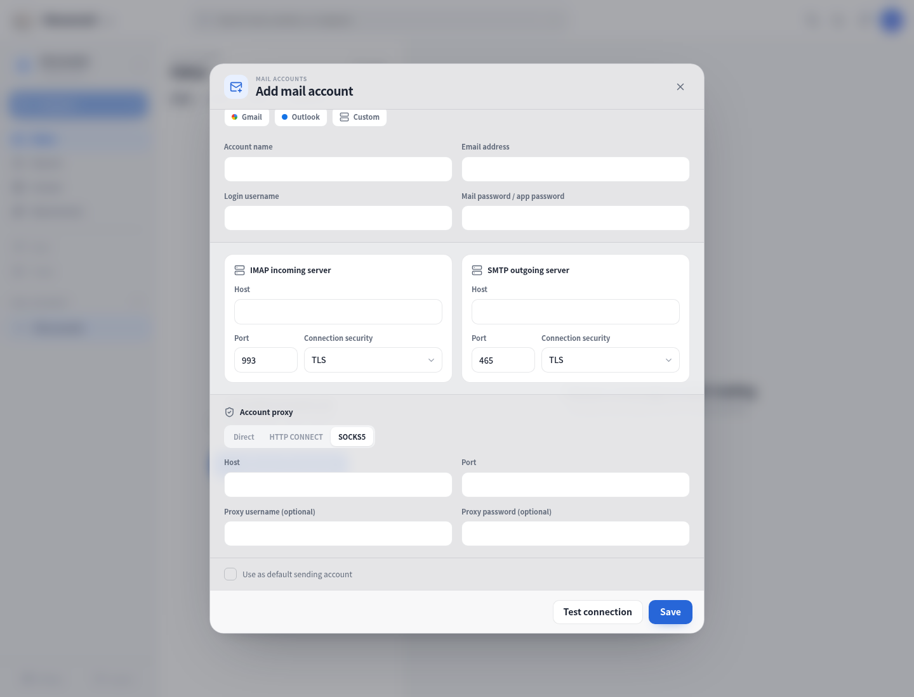
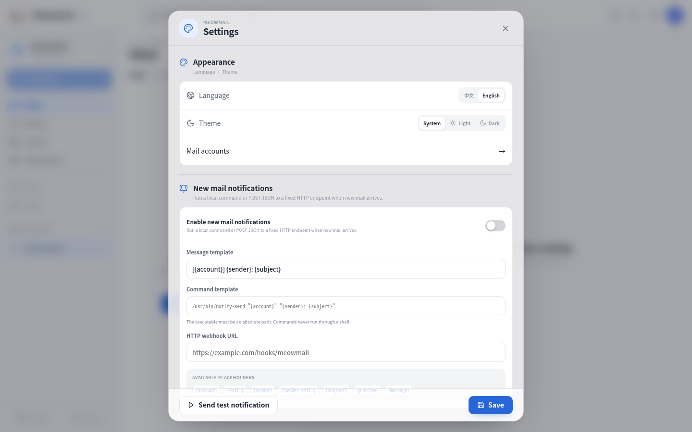
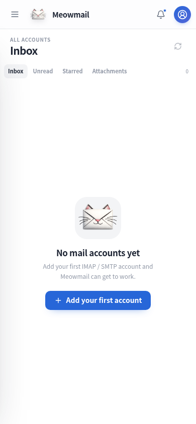

# 妙邮 / Meowmail

妙邮（Meowmail）是一个自托管、单用户、多邮件账户的 Web 邮件客户端。后端使用 Rust、Axum、SeaORM 与 SQLite，前端使用 React 19 与 Vite。生产构建会把完整 Web 资源嵌入 Rust 可执行文件，运行时无需 Node.js 或独立静态文件服务器。

## 界面预览

### 登录与桌面工作区


### 邮件账户代理与通知

| 每账户 HTTP CONNECT / SOCKS5 代理 | 命令与 HTTP Webhook 通知 |
| :---: | :---: |
|  |  |

### 移动端

<p align="center">
  
</p>

## 当前能力

- `/login` PIN 登录；部署只需设置一个安全环境变量 `MEOWMAIL_PIN`
- 多个独立 IMAP / SMTP 邮件账户，可切换默认账户
- 每个邮件账户可单独选择直连、HTTP CONNECT 或 SOCKS5 代理，并支持代理用户名/密码
- IMAP TLS / STARTTLS 收件箱同步、邮件搜索与未读/星标/附件筛选
- SMTP TLS / STARTTLS 发信
- SQLite 本地索引；邮箱密码与代理密码使用 PIN 派生密钥加密保存
- 新邮件命令通知和 HTTP POST Webhook
- 中文 / English 与跟随系统、浅色、深色主题
- 桌面三栏、平板双栏和移动端列表/详情布局
- Docker、GitHub Actions CI 和多平台 Release 自动构建

当前版本使用邮箱密码或服务商提供的“应用专用密码”登录 IMAP/SMTP，尚未实现 OAuth2。同步范围是每个账户 INBOX 中最近 50 封邮件；它适合作为可运行的首个版本，后续可扩展完整文件夹树、分页同步、附件上传和邮件线程。

## 快速启动

要求：Rust 1.94、Node.js 26.4、npm 12.0.1。

```bash
export MEOWMAIL_PIN='请换成至少四个字符的私密 PIN 或口令'
npm --prefix web ci --ignore-scripts
make dev
```

浏览器打开 `http://127.0.0.1:5173/login`。Vite 会把 `/api` 请求代理到监听 `0.0.0.0:8080` 的 Rust 后端。

生产单文件构建：

```bash
make build
MEOWMAIL_PIN='你的 PIN' ./target/release/meowmail
```

打开 `http://127.0.0.1:8080/login`。程序会在当前工作目录下创建 `data/`：

```text
data/
├── meowmail.sqlite3
└── vault.salt
```

`vault.salt` 与当前 `MEOWMAIL_PIN` 一起决定邮箱凭据的解密密钥。更改 PIN 后，原有加密凭据将无法读取；迁移 PIN 前请先重新录入账户或保留旧 PIN。

## Docker

```bash
docker build --tag meowmail:local .
docker volume create meowmail-data
docker run --detach \
  --name meowmail \
  --restart unless-stopped \
  --publish 8080:8080 \
  --env MEOWMAIL_PIN='请换成私密 PIN 或口令' \
  --volume meowmail-data:/data \
  meowmail:local
```

容器以非 root 用户 `10001:10001` 运行，持久数据固定写入 `/data`。建议在 Meowmail 前放置提供 HTTPS 的反向代理；HTTPS 环境下登录 Cookie 会根据 `X-Forwarded-Proto: https` 设置 `Secure`。

## 添加邮件账户

界面提供 Gmail、Outlook 和自定义预设。请确认服务商已启用 IMAP/SMTP，并优先使用应用专用密码：

- Gmail：IMAP `imap.gmail.com:993` TLS；SMTP `smtp.gmail.com:465` TLS 或 `587` STARTTLS
- Outlook：IMAP `outlook.office365.com:993` TLS；SMTP `smtp.office365.com:587` STARTTLS
- 自定义：只接受 TLS 或 STARTTLS，不会通过明文连接发送凭据

代理设置属于每个邮件账户，可选择：

- `direct`：直接连接邮件服务器
- `http`：通过 HTTP `CONNECT` 建立 TCP 隧道，可选 Basic 代理认证
- `socks5`：通过 SOCKS5 建立隧道，可选用户名/密码认证

同一账户的 IMAP 和 SMTP 使用同一套代理设置；不同账户互不影响。

## 新邮件通知

在“设置 → 通知”中可同时配置命令和 HTTP 地址。仅新同步写入 SQLite 的邮件触发通知；通知失败不会让邮件同步失败。

支持的模板占位符：

| 占位符 | 内容 |
| --- | --- |
| `{account}` | 邮件账户显示名 |
| `{email}` | 当前邮件账户地址 |
| `{sender}` | 发件人显示名 |
| `{sender_email}` | 发件人邮箱地址 |
| `{subject}` | 邮件主题 |
| `{preview}` | 邮件摘要 |
| `{message}` | 已渲染的消息模板，仅命令参数可用 |

消息模板示例：

```text
[{account}] {sender}: {subject}
```

命令模板示例：

```text
/usr/bin/notify-send "{account}" "{message}"
```

命令安全边界：

- 可执行文件必须是固定的绝对路径，且不能包含占位符
- 模板先解析为参数，再替换邮件字段
- 程序直接执行 argv，不调用 shell；邮件内容不能增加参数或注入 shell 语法
- 命令标准输入、输出、错误输出关闭，并有 10 秒超时

Webhook 必须是固定的 `http://` 或 `https://` 地址，不能包含模板或 URL 凭据，也不会跟随重定向。请求方法为 `POST`，JSON 格式如下：

```json
{
  "message": "[Work] Alice: Project update",
  "account": "Work",
  "email": "me@example.com",
  "sender": "Alice",
  "senderEmail": "alice@example.com",
  "subject": "Project update",
  "preview": "The latest status is..."
}
```

命令和 Webhook 都由已登录的部署管理员配置，因此拥有与宿主机集成的能力。不要把 PIN 提供给不可信用户，也不要配置不可信可执行文件或地址。

## 安全模型

- 单用户应用，没有应用内多用户或角色系统；“多账户”仅指多个邮件账户
- PIN 不写入 SQLite；凭据使用 Argon2id 派生密钥和 XChaCha20-Poly1305 加密
- 会话保存在服务端内存，Cookie 为 HttpOnly、SameSite=Strict；重启后需重新登录
- 所有写 API 使用 CSRF token，登录失败有节流限制
- HTML 邮件在后端清洗后放入 sandboxed iframe，默认阻止远程图片
- API 有请求体大小限制、通用安全响应头与泛化的外部服务错误
- SQLite 使用 WAL、外键和 busy timeout

建议通过 HTTPS 暴露服务，限制网络访问范围，并定期更新依赖。不要把 `.env`、数据库、盐文件或真实密码提交到版本库。

## 备份与恢复

停止容器或进程后备份完整 `data/` 目录，并安全保存与之对应的 `MEOWMAIL_PIN`。恢复时把整个目录放回相同位置并使用原 PIN。只备份 SQLite 而遗漏 `vault.salt`，或只保留 salt 而遗失 PIN，都无法解密邮箱凭据。

## 开发与验证

```bash
make dev       # Rust API + Vite 开发服务器
make web       # 锁定依赖并构建 Web 资源
make test      # Rust fmt/clippy/test + Web typecheck/test
make build     # Web + release 嵌入式单文件
make docker    # meowmail:local 镜像
```

完整发布前验证：

```bash
npm --prefix web ci --ignore-scripts
npm --prefix web audit --audit-level=high
npm --prefix web audit signatures
npm --prefix web run typecheck
npm --prefix web run test:ci
npm --prefix web run build
cargo fmt --all -- --check
cargo clippy --locked --all-targets --all-features -- -D warnings
cargo test --locked
cargo build --release --locked
```

推送 `v*` tag 后，`.github/workflows/release.yml` 会构建 Linux x86_64/aarch64、Windows x86_64、macOS x86_64/aarch64 压缩包，生成 `SHA256SUMS` 并发布到 GitHub Release。

## License

MIT
